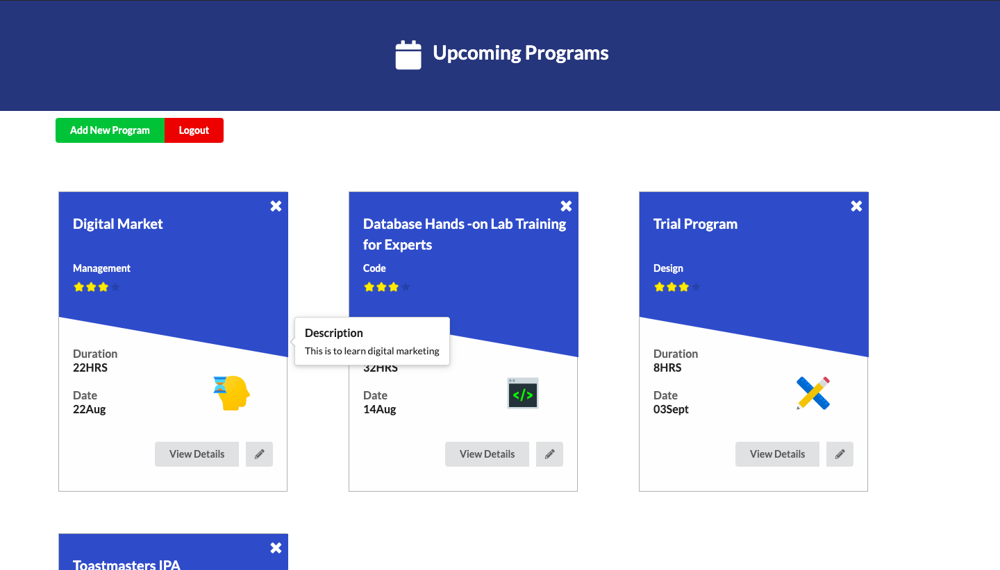
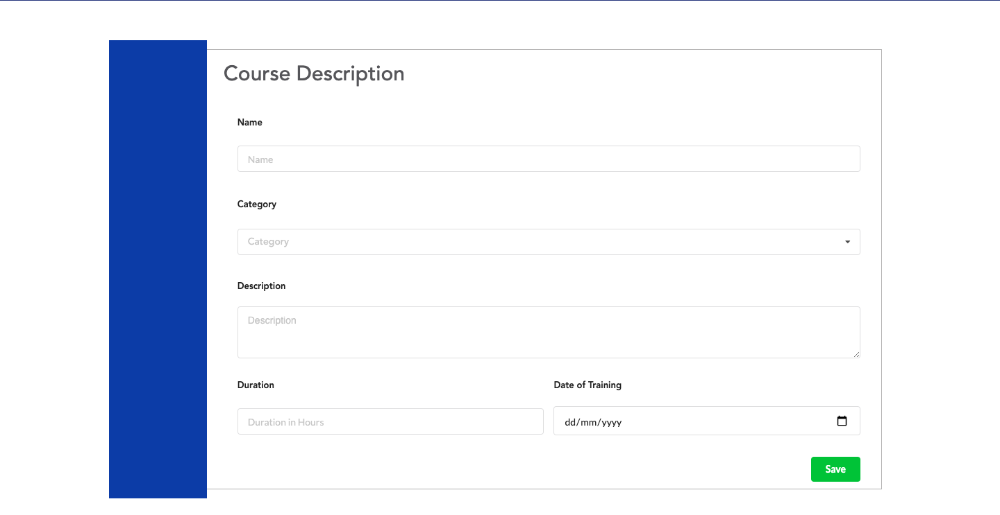
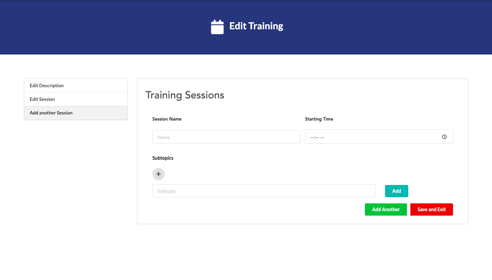
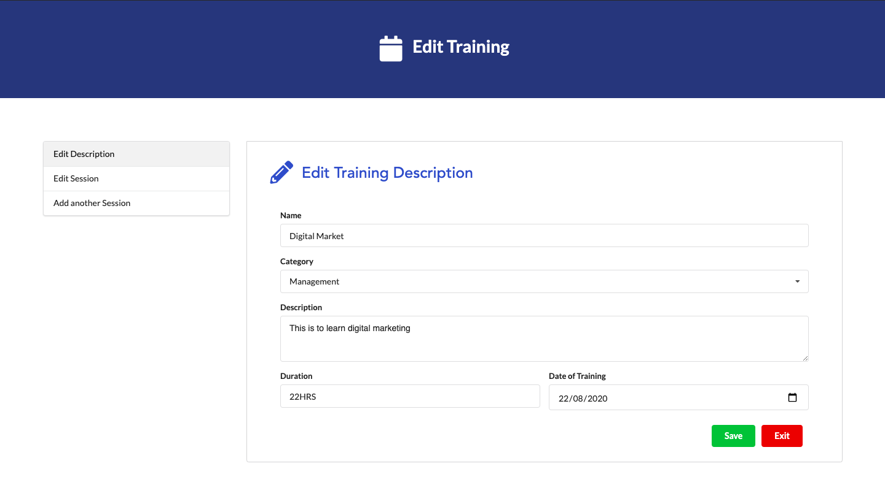
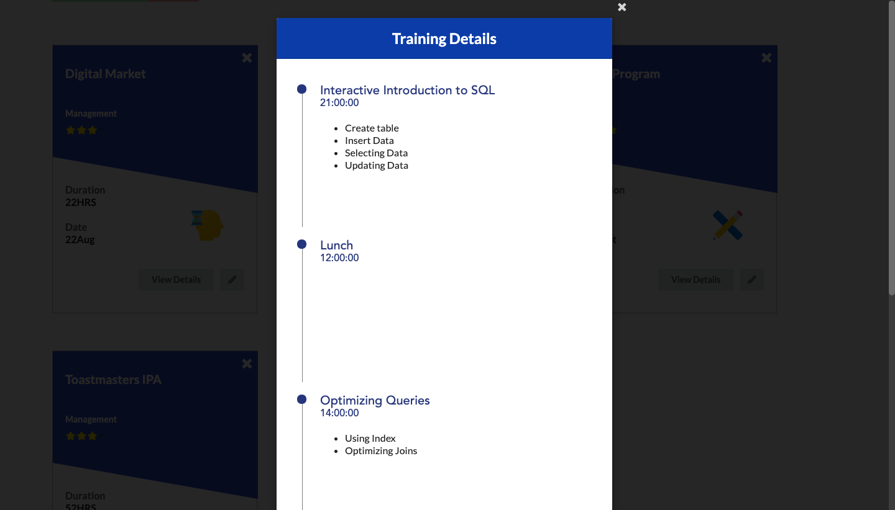

This project is deployed on the following url:
http://trainingpro.herokuapp.com/trainings

## Training Scheduler

This project primaruly focuses on the aspect to arrange online training and for the user to view and participate in them as a part of it.

It has two kind of users :

1. Admin - Has the right to make, edit and delete the training

2. Participant - Has the right to participate in the trainings and view its schedule only if particiapted in it.

## Tech Stack

- NodeJS for creating servr for deployment
- ReactJS as the frontend library for developing the application
- As a backend Database query to fetch, update and delete data from the Database

## Screenshots

